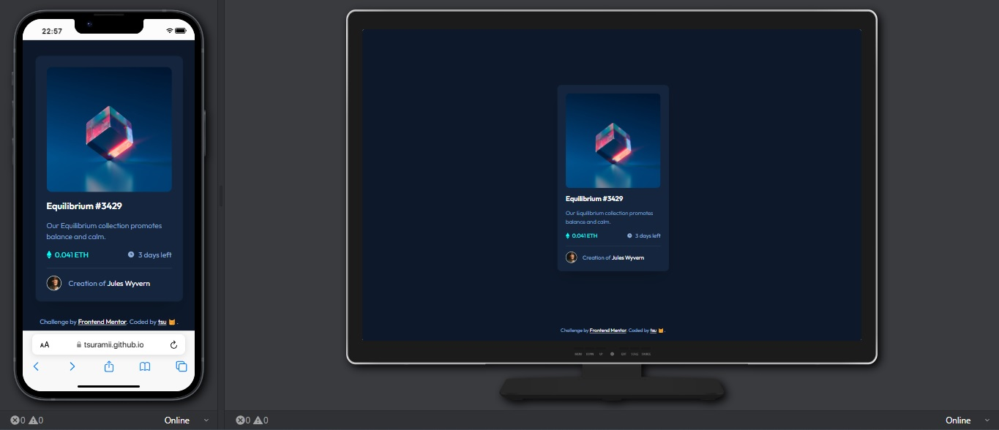

# Frontend Mentor - NFT preview card component solution

This is a solution to the [NFT preview card component challenge on Frontend Mentor](https://www.frontendmentor.io/challenges/nft-preview-card-component-SbdUL_w0U). Frontend Mentor challenges help you improve your coding skills by building realistic projects.

## Table of contents

- [Overview](#overview)
  - [The challenge](#the-challenge)
  - [Screenshot](#screenshot)
  - [Links](#links)
- [My process](#my-process)
  - [Built with](#built-with)
  - [What I learned](#what-i-learned)
  - [Useful resources](#useful-resources)

## Overview

### The challenge

Users should be able to:

- View the optimal layout depending on their device's screen size
- See hover states for interactive elements

### Screenshot



### Links

- Solution URL: [My Frontend Mentor Solution](https://www.frontendmentor.io/solutions/nft-preview-card-component-with-tailwindcss-hmXHIlOTg0)
- Live Site URL: [GitHub Pages deploy](https://tsuramii.github.io/nft-preview-card-component-main/)

## My process

### Built with

- Semantic HTML5 markup
- Flexbox
- Mobile-first workflow
- [TailwindCSS](https://tailwindcss.com) - A utility-first CSS framework

### What I learned

In the course of this project, I gained valuable insights and skills. One notable achievement was learning how to implement a hover overlay on an image using Tailwind CSS. Below is the code snippet for achieving this effect:

```html
<figure class="relative group">
    
    <div class="absolute inset-0 bg-cyan/50 opacity-0 group-hover:opacity-100 transition-opacity duration-300 flex items-center justify-center cursor-pointer rounded-xl">
        
    </div>
</figure>

```

### Useful resources

- [How TO - Image Hover Overlay](https://www.w3schools.com/howto/howto_css_image_overlay.asp) - How to Create Image Hover Overlay Effects - This resource played a significant role in deepening my understanding of image hover overlays.
